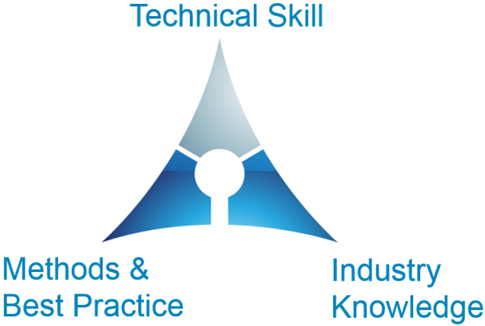
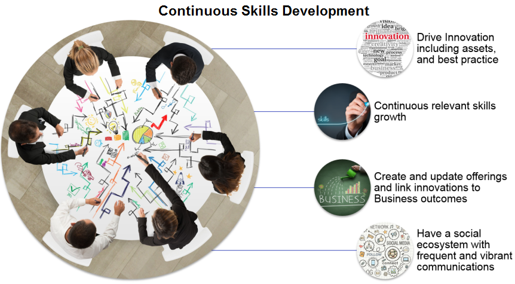

# Continuous Skills Development
As the Garages become larger, we are facing challenges in responding to growth and frequent change, just keeping up to date is becoming a full-time exercise.
But even so, it remains the responsibility of every Garage technical consultants to help drive our technical vitality through continuous growth in skills, giveback, and mentoring. 

We need to re-imagine how our Garages work. We want the Garages to transform themselves into a nexus point, bringing focus for our Garage technical consultants and supporting business and technical growth. This will ensure we stay relevant and able to meet the demands of the market.

## Skills Trinity - Our skills missions
1. We need to constantly and tirelessly build skill and knowledge to become the trusted advisors to our clients
2. Our skills need to be current, relevant and responsive to the demands in the market place
3. We need to draw upon and build industry knowledge and experiences to bring more relativity and credibility in our client interactions

Innovation that matters for our practice. "Restlessly reinvent our company and yourselves."

## Technical Skills
As Cloud Garage technical consultants, our vitality is measured by our contributions not just in utilization but also in gaining new skills, driving innovation and collaboration within our teams. We need to examine our contributions continuously.

Community of Practice Activities
- Harvest Intellectual Capital 
- Update/Create Service Offerings
- Link Community to Mentors
- Interlock with IBM Garage Solution Engineering Team
- Grow Social eminence of community
- Monthly Technical Vitality calls

Skilling Opportunities are Everywhere
- [IBM Garage](https://www.ibm.com/garage)
- [Medium IBM Garage](https://medium.com/ibm-garage)
- [Medium.com publications](https://medium.com) 
- [(YL) Your Learning](https://yourlearning.ibm.com)
- [IBM Developer](https://developer.ibm.com/)
- [Redbooks](http://www.redbooks.ibm.com/)
- [O'Reilly - Safari](https://w3-connections.ibm.com/wikis/home?lang=en-us#!/wiki/IT%20Content%20Availability/page/Safari%20Books%20Online)
- [TED Talks](https://www.ted.com/talks)
- [IBM Training and Skills](https://www.onlinedigitallearning.com/my/)
- [Industry Jumpstarts](https://mooc.w3bmix.ibm.com/)
- [IBM - Red Hat Partnership on ZACS](https://ibm.co/2HY6hLC)
	- Partnership Overview
	- Frequently Asked Questions
	- Partnership Roadmap
	- Pricing
	- Videos/Demos
	- Competitive Battlecard
	- Client Facing Deck

### RMT and skill updates
- Inertia in skill building
- Continuous transformation
- Anticipate ahead of the demand curve
	- Requires an accurate snapshot of the current skill pool
	- Provides a visibility on where mid-long term skill reqs
	
### Badge Attainment and Career Plan
**Set Your Destination**
- "Planning is bringing the future into the present so that you can do something about it now." – Alan Lakein
- You want to establish a career destination for yourself over at least 2 years. Use this plan to inform your skilling and badging choices
- If unsure how to do this then get a career mentor

**Understand what will help you reach your destination**
- Establish a list a skills/badges that will help you to reach your destination
- Review this once a quarter to remind your of the destination to get reinvigorated and check that the destination is still indeed aligned to what you want
- Check each quarter for new badges that will help you t reach the destination

**Build and Execute a plan**
- From available options prioritize and establish a plan for badge and skill attainment
- Set goals and timeline for the plan and commit your checkpoint goals as additional motivation

### Know which badges will help you
There are a variety of badges but I tend to narrow them to 3 broader categories,  
- Knowledge badges typically simpler to attain but contribute to your broad knowledge base
- Skills or Experiential related badges require that you have worked or had practitioner experience typically to attain so make sure that you either have the skill or have a agreed work trajectory with your manager that will support this goal
- Career / Certification badges are more long term objectives that require deeper preparation and study so look at the requirement and build your plan around that, such badges often have dependent badges that need to also be attained 

### Badge – a call to action
1. Set yourself specific goals each quarter and give it the time and priority needed to achieve the goal
2. Agree the goals and make them **checkpoint** targets with your manager
3. Be realistic about what you can achieve blend a mix of Knowledge, Experiential, and Certification/Career badging
4. Do not feel constrained or limited to your pillar or what your know today especially when it comes to Knowledge badges
5. Do not do it alone when leaning new skills knowledge reach out and get a mentor or seek guidance from your manager

## Mission
Drive innovation and skills growth across the Garages.  Help the IMTs become more self sufficient and resilient to changes in people, technology and environment. Ensure the readiness of the Garage technical consultants and to be leaders in Garage Method adoption and execution.
### Leadership objectives
- Grow and build the Garage technical consultants into senior Technical Leaders.
- Drive the adoption of Garage Method through the [Architecture center](https://www.ibm.com/cloud/garage/architectures) center by taking courses, webinars, and tutorials. Help identify, harvest, and create Intellectual Capital that supports and drives new business outcomes.
- Provide a framework of technical leadership supporting sales and help IMT leaders to to build the pipeline and win new projects

### Success Factors 
- Measured skill growth with specialists being badged/certified and with transition of SME's to architects.  Demonstrated technical leadership in support of licenses sales and delivery. 
- Evidence of vibrant active community, with a history of regular meetings, contribution of "**graduated**" intellectual capital, and social interactions (Slack, blogging, FAQ)
- Clear enablement plans and treatments of skills gap, participation in delivery excellence including project reviews and helping establish and execute improvements plan for Garage technical consultants

## Call To Action
**Raise your Technical Vitality score Today**
IBM Singapore Cloud Garage team conducted a ideation session to brain storm initiatives that can help transform our business, drive innovation and build street cred with our clients. From this session the team identified 12 ideas that we are now in process of shortlisting for further exploration through:
- Shadowing / pairing
- Pet projects
- Initiatives
- Publications
- Building collaterals
- Interlock with business units
- Community giveback
- Reviewing existing offerings
- Service Offerings
- Project Case Studies
- Reference Architecture
- Developing an Enablement / Education plan to help to fill any identified skills gaps

Challenge yourself with a learning plan to build skills broadly, deeply and continuously.
Engage in giveback conversations and participate in your communities of practice. 
Join the conversation, send messages in slack channels, write a blog and share your expertise.